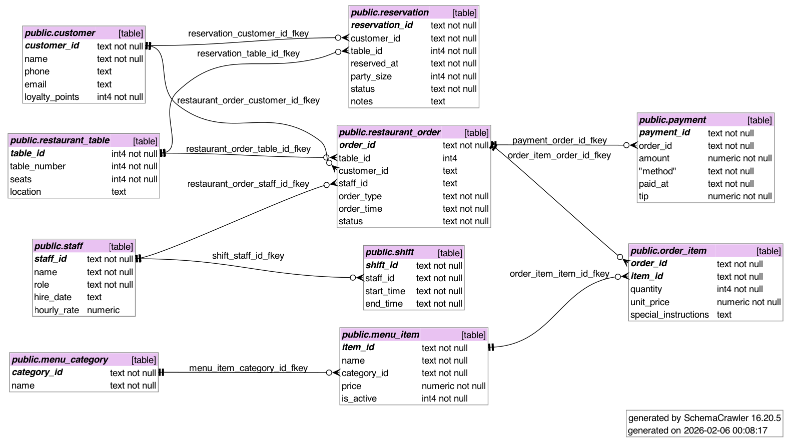

### Response that did work:

Question: Which customers have a 'Booked' reservation for the patio?

``` sql
FROM customer c
JOIN reservation r ON c.customer_id = r.customer_id
JOIN restaurant_table t ON r.table_id = t.table_id
WHERE r.status = 'Booked' AND t.location = 'Patio';
```

Response: Hey there! It looks like the only customer with a 'Booked' reservation for the patio is Sofia Garcia. No other customers have a 'Booked' reservation for the patio at the moment. If you need further assistance or have any other questions, feel free to ask!

### Response that did NOT work:

Question: What are the three most ordered menu items, and how many times has each been ordered?

``` sql
Generated SQL: SELECT item_id, name, COUNT(item_id) AS order_count
FROM order_item
JOIN menu_item ON order_item.item_id = menu_item.item_id
GROUP BY item_id, name
ORDER BY order_count DESC
LIMIT 3;
```

### Other Example Questions:

1.
Question: How much total revenue has the restaurant made from closed orders?

Generated SQL:
``` sql
SELECT SUM(amount) AS total_revenue
FROM payment
INNER JOIN restaurant_order ON payment.order_id = restaurant_order.order_id
WHERE restaurant_order.status = 'Closed';
```
Response: _Hey there! The total revenue from closed orders is $90.25. It looks like the restaurant has made a decent amount from those completed orders. If you have any more questions or need further assistance, feel free to ask!_

2.
Question: Enter your question: Which customer has earned the most loyalty points, and how many do they have?
Generated SQL:
``` sql
SELECT customer_id, name, loyalty_points
FROM customer
ORDER BY loyalty_points DESC
LIMIT 1;
```

Response: _Hey there! 🍽️ It looks like Mia Patel is our most loyal customer, with a whopping 300 loyalty points! Mia's definitely racking up those points. Keep up the great work, Mia! If you need anything else, just let me know!_

Response: _An error occurred: column reference "item_id" is ambiguous
LINE 1: SELECT item_id, name, COUNT(item_id) AS order_count_

3.
Question: Which server handled the most dine-in orders in February 2026?

Generated SQL:
```sql
SELECT staff_id, COUNT(*) AS num_dinein_orders
FROM restaurant_order
WHERE order_type = 'DineIn' AND order_time >= '2026-02-01' AND order_time < '2026-03-01'
GROUP BY staff_id
ORDER BY num_dinein_orders DESC
LIMIT 1;
```

Response _Hey there! It looks like in February 2026, the server with the ID S001 handled the most dine-in orders, with a total of 2 orders. Good job, S001! If you need more info or have any other questions, feel free to ask!_

4.
Question: What is the total revenue (including tips) generated by each server?
#### Generated SQL
```sql
SELECT staff_id, 
       SUM(amount + tip) AS total_revenue
FROM restaurant_order
JOIN payment ON restaurant_order.order_id = payment.order_id
WHERE staff_id IS NOT NULL
GROUP BY staff_id;
```
#### Response:
Hey there! I've got the total revenue (including tips) generated by each server. Here's the breakdown:

- Server S003 brought in a total of $36.25.
- Server S001 raked in a total of $63.00.

Looks like both servers have been doing a great job! If you have any more questions or need further details, feel free to ask!

It did Ok on this one and performed the correct join and performed the correct math, but it returned server ID's when someone would probably want their names, and there was some confusion in the response on staff roles, as S003 is a host not a server.

5.
Question: Who are the top 3 customers with the most loyalty points?
#### Generated SQL
```sql
SELECT name, loyalty_points
FROM customer
ORDER BY loyalty_points DESC
LIMIT 3;
```
#### Response:
Hey there! The top 3 customers with the most loyalty points are:

1. Mia Patel with 300 loyalty points
2. Ava Johnson with 120 loyalty points
3. Sofia Garcia with 80 loyalty points

Looks like Mia is leading the pack with the most loyalty points. Keep up the great work, and let me know if there's anything else I can help with!

Result: Success!

6.
Question:
Which staff members worked shifts on February 1st, 2026?
#### Generated SQL:
```sql
SELECT * 
FROM shift 
WHERE start_time::DATE = '2026-02-01'
```
#### Response:
Hey there! It looks like we've got the info you need. On February 1st, 2026, the following staff members worked shifts:

- Staff ID S003 worked from 4:00 PM to 10:00 PM (Shift ID SH001)
- Staff ID S001 worked from 5:00 PM to 11:00 PM (Shift ID SH002)
- Staff ID S002 worked from 3:00 PM to 11:00 PM (Shift ID SH003)

Looks like everyone was busy that day! If you have any more questions or need further details, feel free to ask!

Result: It got all the correct names, but again listed them as Staff ID and not by name.

# Picture of Schema


# Description of Database
This database models the "all-in-one" system for running a restaurant. It tracks the whole experience: from someone booking a table to paying for their order. It also handles the staff side of things, like who's working when and which server is handling which orders, and the tips made from them. It would allow a restaurant manager to be able to query any information from menu items, to staffing schedules and payments using our text-2-sql tool.

# Prompting strategies:
